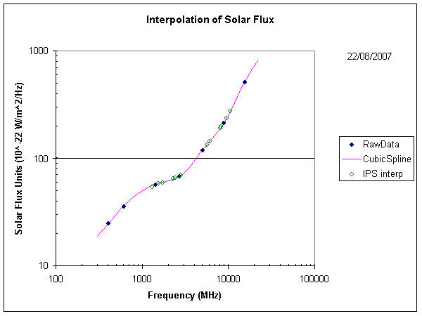

# QSRF - quiet sun radio flux
Quiet sun radio noise is often used for measurements of radio receiving systems. The radio flux from the quiet sun is a known signal in that it is measured and reported at observatories around the earth, and therefore provides a basis of assessment of radio receiving systems.



This project is a script to calculate interpolated recent solar flux data for amateur radio UHF and microwave bands from observations published by NOAA for several solar observatories around the world.

This is a Python batch calculator to provide an alternative to the online calculator previosly published at http://owenduffy.net//calc/qsrf/index.htm and no longer online.

The original web page is in the old folder for documentation, but the calculator will not run.

The work is copyright: Owen Duffy 2025. All rights reserved.

Permission is granted for personal / private / non-commercial use.

## Example run
```
D:\src\qsrf>qsrf  144 432.1 1296 5760 10368
qsrf v0.01
HTTP request https://services.swpc.noaa.gov/text/solar_radio_flux.txt RC: 200
-----------------------------------------------------------------------------
:Product: Solar Radio Data             7day_rad.txt
:Issued: 0152 UTC 22 Feb 2025
#
# Prepared by the U.S. Dept. of Commerce, NOAA, Space Weather Prediction Cent
# Please send comments and suggestions to SWPC.Webmaster@noaa.gov
#  Units: 10^-22 W/m^2/Hz
#  Missing Data:  -1
#
#    Daily local noon solar radio flux values - Updated once an hour
#
  Freq  Learmonth  San Vito  Sag Hill  Penticton  Penticton  Palehua  Pentict
   MHZ   0500 UTC  1200 UTC  1700 UTC   1700 UTC   2000 UTC  2300 UTC  2300 U


2025 Feb 16
NOAA data:
   245       28        -1        25         -1         -1        29        -1
   410       46        -1        41         -1         -1        49        -1
   610       73        -1        76         -1         -1        80        -1
  1415      134        -1       119         -1         -1       138        -1
  2695      181        -1       195         -1         -1       184        -1
  2800       -1        -1        -1        185        185        -1       185
  4995      213        -1       227         -1         -1       218        -1
  8800      293        -1       285         -1         -1       311        -1
 15400      581        -1       515         -1         -1       591        -1
Calculated cubic spline interpolations / extrapolations:
   144       23        -1        31         -1         -1        24        -1
   432       49        -1        45         -1         -1        52        -1
  1296      128        -1       117         -1         -1       133        -1
  5760      223        -1       229         -1         -1       230        -1
 10368      346        -1       335         -1         -1       370        -1
-----------------------------------------------------------------------------
2025 Feb 17
NOAA data:
   245       26        21        -1         -1         -1        26        -1
   410       45        43        -1         -1         -1        49        -1
   610       74        72        -1         -1         -1        78        -1
  1415      133       131        -1         -1         -1       139        -1
  2695      185       167        -1         -1         -1       178        -1
  2800       -1        -1        -1        184        185        -1        -1
  4995      208       247        -1         -1         -1       206        -1
  8800      279       267        -1         -1         -1       284        -1
 15400      571       561        -1         -1         -1       468        -1
Calculated cubic spline interpolations / extrapolations:
   144       21        11        -1         -1         -1        15        -1
   432       48        46        -1         -1         -1        52        -1
  1296      128       126        -1         -1         -1       134        -1
  5760      214       263        -1         -1         -1       217        -1
 10368      334       268        -1         -1         -1       329        -1
-----------------------------------------------------------------------------
2025 Feb 18
NOAA data:
   245       26        18        21         -1         -1        25        -1
   410       47        43        44         -1         -1        50        -1
   610       77        74        70         -1         -1        81        -1
  1415      139       132       121         -1         -1       132        -1
  2695      182       164       178         -1         -1       171        -1
  2800       -1        -1        -1        175        178        -1       175
  4995      209       231       217         -1         -1       205        -1
  8800      290       262       290         -1         -1       300        -1
 15400      577       557       556         -1         -1       619        -1
Calculated cubic spline interpolations / extrapolations:
   144       19         6         8         -1         -1        13        -1
   432       50        47        47         -1         -1        54        -1
  1296      134       128       116         -1         -1       129        -1
  5760      218       245       226         -1         -1       217        -1
 10368      345       274       339         -1         -1       361        -1
-----------------------------------------------------------------------------
2025 Feb 19
NOAA data:
   245       28        -1        21         -1         -1        23        -1
   410       47        43        43         -1         -1        51        -1
   610       77        76        71         -1         -1        83        -1
  1415      130       131       114         -1         -1       137        -1
  2695      171       160       175         -1         -1       176        -1
  2800       -1        -1        -1        172        178        -1       175
  4995      195       256       217         -1         -1       209        -1
  8800      286       264        -1         -1         -1       302        -1
 15400      569       573       546         -1         -1       549        -1
Calculated cubic spline interpolations / extrapolations:
   144       24        -1        12         -1         -1         8        -1
   432       50        47        46         -1         -1        55        -1
  1296      126       127       111         -1         -1       133        -1
  5760      204       275       209         -1         -1       221        -1
 10368      348       253       138         -1         -1       358        -1
-----------------------------------------------------------------------------
2025 Feb 20
NOAA data:
   245       26        -1        28         -1         -1        30        -1
   410       43        43        45         -1         -1        52        -1
   610       74        78        75         -1         -1        85        -1
  1415      128       134       122         -1         -1       140        -1
  2695      173       162       171         -1         -1       176        -1
  2800       -1        -1        -1        178        184        -1       182
  4995      198       264       227         -1         -1       224        -1
  8800      278       264       288         -1         -1       321        -1
 15400      564       564       560         -1         -1       590        -1
Calculated cubic spline interpolations / extrapolations:
   144       26        -1        27         -1         -1        24        -1
   432       46        47        48         -1         -1        56        -1
  1296      124       131       119         -1         -1       137        -1
  5760      206       283       239         -1         -1       240        -1
 10368      335       245       324         -1         -1       373        -1
-----------------------------------------------------------------------------
2025 Feb 21
NOAA data:
   245       30        20        41         -1         -1        29        -1
   410       46        42        46         -1         -1        54        -1
   610       77        76        72         -1         -1        85        -1
  1415      132       138       127         -1         -1       147        -1
  2695      181       182       213         -1         -1       200        -1
  2800       -1        -1        -1        199        197        -1       194
  4995      206       288       257         -1         -1       242        -1
  8800      287       285       317         -1         -1       337        -1
 15400      571       589       577         -1         -1       600        -1
Calculated cubic spline interpolations / extrapolations:
   144       31        15        54         -1         -1        17        -1
   432       49        46        48         -1         -1        58        -1
  1296      128       134       121         -1         -1       142        -1
  5760      213       306       262         -1         -1       255        -1
 10368      346       267       365         -1         -1       393        -1
-----------------------------------------------------------------------------
2025 Feb 22
NOAA data:
   245       -1        -1        -1         -1         -1        -1        -1
   410       -1        -1        -1         -1         -1        -1        -1
   610       -1        -1        -1         -1         -1        -1        -1
  1415       -1        -1        -1         -1         -1        -1        -1
  2695       -1        -1        -1         -1         -1        -1        -1
  2800       -1        -1        -1         -1         -1        -1        -1
  4995       -1        -1        -1         -1         -1        -1        -1
  8800       -1        -1        -1         -1         -1        -1        -1
 15400       -1        -1        -1         -1         -1        -1        -1
Calculated cubic spline interpolations / extrapolations:
   144       -1        -1        -1         -1         -1        -1        -1
   432       -1        -1        -1         -1         -1        -1        -1
  1296       -1        -1        -1         -1         -1        -1        -1
  5760       -1        -1        -1         -1         -1        -1        -1
 10368       -1        -1        -1         -1         -1        -1        -1
-----------------------------------------------------------------------------

D:\src\qsrf>
```
